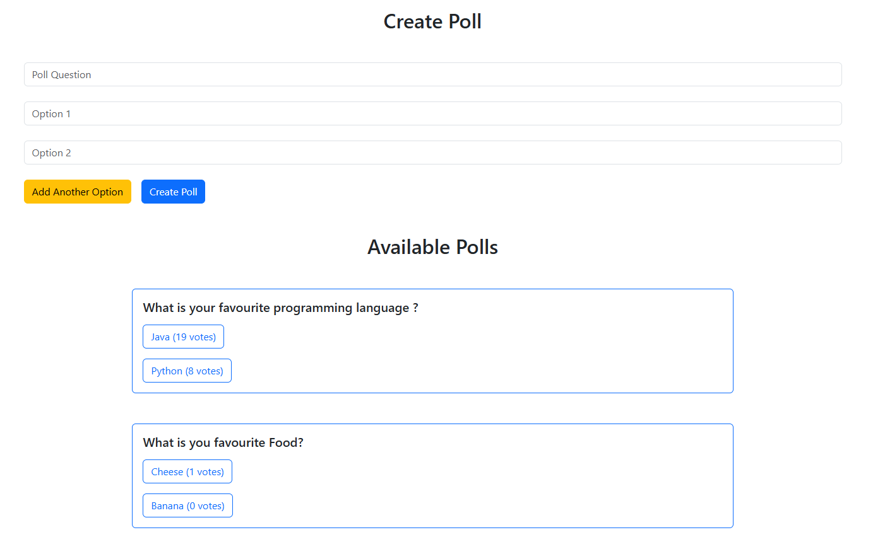

# My Project

## 🗳️ Poll Voting Application

A full-stack web application for creating and participating in polls, built using **Angular** for the frontend and **Spring Boot** for the backend.



---

## 🚀 Features

- ✅ Create custom polls with dynamic options
- 🗳️ Vote on existing polls
- 💡 Simple and intuitive UI
- 🧩 Modular frontend and backend architecture

---

## 🛠️ Tech Stack

### Frontend (Angular)

- Angular 19
- TypeScript
- Bootstrap / CSS

### Backend (Spring Boot)

- Spring Boot 3.4.3
- REST API
- Java
- Postgres

---

## 📷 Screenshots

> See the screenshot above for a live view of the poll creation and voting interface.

---

## ⚙️ How to Run Locally

### 1. Clone the repository

```bash

git clone https://github.com/redaachouhad/poll-voting-application.git

cd poll-voting-application

```

### 2. Run the Backend (Spring Boot)

```bash

cd backend

./mvnw spring-boot:run

```

By default, the backend runs at: http://localhost:8080

## 🙋‍♂️ Author

**Reda Achouhad**

[GitHub Profile](https://github.com/redaachouhad)
